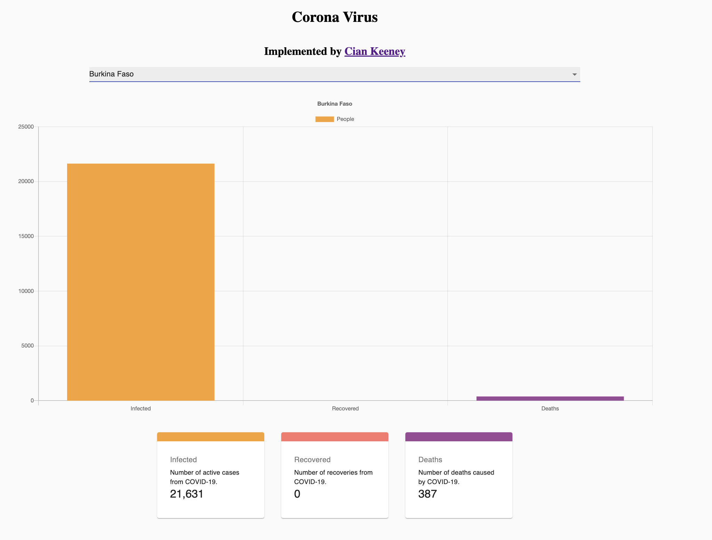

# CoronaVirusTracker

This is a Corona Virus React Web Applications using React Hooks, Material UI React component library, and Charts.js for the graph that displays the inected, recovered, and deaths of Corona Virus. In addition to these, the web applications uses an API that provides a JSON object that is able to be parsed and displayed in the React Web Application. The Application uses Async and Await to have the data be able to display on the webpage. 

## Webpage Screenshot

## Run Project

To run the project on your own machine. Please do this steps:
1. Git clone the reposistory or download the ZIP file and navigate inside the CORONA-VIRUS-DATA.
2. Do an **npm install** for installing all the project dependencies.
3. Do an **npm install -g nodemon** for installing all the project dependencies.
4. Then **npm start** to get the app running on local host.

## Directory Structure

The directory consists of 3 main directories: public, src, and node_modules. 
1. The node_modules directory contains all the React dependencies packages.
2. The public directory contains the favicon that is used in the browser and the index.html file that allows for the screen readers and meta data to be implemented into the webpage.
3. The src directory contains three child directories (api, components, and images) that contain the child components of “App.js”. 
    * For now, the webpage is split into three different components. 
        * The first is the Cards components which displays the number of confirmed cases of Covid, recovered cases from Covid, and deaths related to Covid. 
        * The second component is the Chart component. It fetched the data from one of the API calls made in the api component. It uses the UseEffect hook to asynchourously fetch the data and display it on the webpage once the data has been passed the the Chart component. 
        * The third and final component is the CountryPicker component. The component fetches the data by using the API call and when the user picks an option from the dropdown menu, the graph will render or rerender to the specified country. 

## Axios

One of the main components of this proejct is the use of Axios. 

Axios is an HTTP client library based on promises. It makes sending asynchronous HTTP requests to REST endpoints easier.

This REST endpoint/API could be an external API like the Canvas LMS API or GitHub API. In my case, it is a Corona Virus tracking endpoint that supplies me with a JSON object that I use to be able to display the data on the webpage

One advantage of using Axios instead of fetch() is Axios uses XMLHttpRequest under the hood, and it is widely supported by most browsers, including older ones like Internet Explorer 11. Fetch(), on the other hand, is only compatible with Chrome 42+, Firefox 39+, Edge 14+, and Safari 10.3+. Unlike the Fetch API, which requires you to check the status code and throw the error yourself, Axios has better error handling and can throw 400 and 500 range errors.

